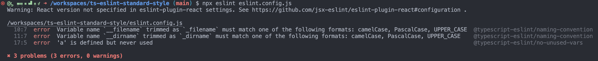

# Steps

## Init project

```sh
pnpm init -y
```

```sh
npm pkg set type="module"
```

## Install dependencies

- TypeScript
- ESLint
- Lintting configs & plugins in **Standard Style**

```sh
pnpm add -D \
  typescript@\* \
  eslint@^8.0.1 \
  eslint-plugin-promise@^6.0.0 \
  eslint-plugin-import@^2.25.2 \
  eslint-plugin-n@^15.0.0 \
  @typescript-eslint/eslint-plugin@^7.0.1 \
  eslint-config-love@latest \
  typescript-eslint@^7.6.0 \
  globals@^15.0.0
```

## Init TypeScript

```sh
npx tsc --init
```

## Create ESLint configuration file

`eslint.config.js`:

```js
import globals from 'globals'
import tseslint from 'typescript-eslint'

import path from 'path'
import { fileURLToPath } from 'url'
import { FlatCompat } from '@eslint/eslintrc'
import pluginJs from '@eslint/js'

// mimic CommonJS variables -- not needed if using CommonJS
const __filename = fileURLToPath(import.meta.url)
const __dirname = path.dirname(__filename)
const compat = new FlatCompat({
  baseDirectory: __dirname,
  recommendedConfig: pluginJs.configs.recommended
})

export default [
  { files: ['**/*.js'], languageOptions: { sourceType: 'script' } },
  { languageOptions: { globals: globals.browser } },
  ...compat.extends('love'),
  ...tseslint.configs.recommended
] 
```

## Try to lint js file

```sh
npx eslint eslint.config.js
```



## Try to lint a `.ts` file

create a `index.ts`:

```js
const x = {
    a: "b",
    b: 123
};
```

```sh
npx eslint index.ts
```

that also works.


## Configure linting commands

edit `package.json`

```diff
{
  "scripts": {
    "test": "echo \"Error: no test specified\" && exit 1",
+   "lint": "eslint ."
```

don't forget to exclude some files that should not be lint, create a `.eslintignore`:

```txt
node_modules
test
coverage
public
dist
```

now try the script

```sh
pnpm lint
```

all problems in your js & ts files will be shown.


## Configure formatting commands

there are some problems can be fixed by the command `eslint --fix`

edit `package.json`

```diff
{
  "scripts": {
+    "format": "eslint --fix ."
```

now try to format it

```sh
pnpm format
```

since some problems have been fixed, only those what can't be fixed will show


> Once again, formatting codes using ESLint is self-asserting

## VS Code editor setting

Configure your VS Code editor, to auto insert 2 spaces after you click the `Tab` key, instead of inserting a real `Tab`, following the rule defined by [Standard JS](https://standardjs.com/rules)

create the configure file

```sh
mkdir .vscode && touch .vscode/settings.json
```

edit `.vscode/settings.json`:

```json
{
  "editor.tabSize": 2,
  "editor.insertSpaces": true,
  "editor.detectIndentation": false
}
```

## VS Code ESLint extension

use `pnpm lint` and `pnpm format` to check and format your code can be very laborious job, you can do them by integrating with ESLint VS Code extension.

search `dbaeumer.vscode-eslint` on the Extensions pannel and install it.

you'll see error shown on editor

## Auto format on save

edit `.vscode/settings.json`:

```diff
+  "eslint.enable": true,
+  "eslint.format.enable": true,
+  "editor.formatOnSave": true,
+  "editor.defaultFormatter": "dbaeumer.vscode-eslint"
}
```

Now every time you edit your file, and pres `command + s` to save it, those problems can be automatically fixed will be fixed.

## Git ignored files

```sh
touch .gitignore
```

```txt
node_modules
dist
```

## Linting React and React Hooks

```sh
pnpm add react react-dom
```

```sh
pnpm add @types/react @types/react-dom
```

create `react-code-1.tsx`:


edit `tsconfig.json`:

```diff
-    // "jsx": "preserve",                                /* Specify what JSX code is generated. */
+    "jsx": "react",                                /* Specify what JSX code is generated. */
```

The error above will disappear.

now lint the `tsx` file:

```sh
npx eslint react-code-1.tsx
```

you'll find 14 problems:


create `react-code-2.jsx` with the same code:

now lint the `jsx` file:

```sh
npx eslint react-code-2.jsx
```


because `.jsx` file is not define in the ESLint config, let's configure it in `eslint.config.js`:

```diff
export default [
-  { files: ['**/*.js'], languageOptions: { sourceType: 'script' } },
+  { files: ['**/*.{js,ts,jsx,tsx}'], languageOptions: { sourceType: 'script' } },
  { languageOptions: { globals: globals.browser } },
```

lint it again and you'll get 14 errors same to `react-code-1.tsx`.


```sh
pnpm add -D eslint-plugin-react eslint-plugin-react-hooks
```

```diff
export default [
  { files: ['**/*.{js,ts,jsx,tsx}'], languageOptions: { sourceType: 'script' } },
  { languageOptions: { globals: globals.browser } },
+  ...compat.extends('plugin:react/recommended'),
```

run `npx eslint react-code-1.tsx` again you'll find 15 problems, in contrast with the previous 14 problems, because 1 more rule is being applied in this file.


Ok let take one further step, edit `eslint.config.js` to extend your self-customed rule:

```diff
export default [
  { files: ['**/*.{js,ts,jsx,tsx}'], languageOptions: { sourceType: 'script' } },
  { languageOptions: { globals: globals.browser } },
  ...compat.extends('plugin:react/recommended'),
  ...tseslint.configs.recommended,
  ...compat.extends('love'),
+  {
+    rules: {
+      'react/destructuring-assignment': ['warn', 'always']
+    }
+  }
]
```

run `npx eslint react-code-1.tsx`, again you'll get 1 more problems which is define by you.


edit `react-code-1.tsx`:

```diff
-import React from "react";
+import React, { useContext } from "react";

...

const MyComponent = (props) => {

+  if (true) {
+    const theme = useContext(ThemeContext);
+  }

  return (<div id={props.id} />)
};
```

now lint it you'll find some errors but none related with react hooks.


edit the ESLint config:

```diff
  ...compat.extends('plugin:react/recommended'),
+  ...compat.extends('plugin:react-hooks/recommended'),
  ...tseslint.configs.recommended,
```

lint again now you'll get error related to react hooks.

