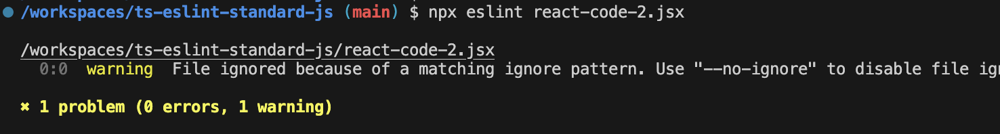

## Introduction

Configuring ESLint in a TypeScript project is an easy thing, but choosing a **Code Style** for your team can be challenging.

You may be swaying between those famous Code Styles, struggling to choose one between [Airbnb JavaScript Style](https://github.com/airbnb/javascript), [Google JavaScript Style Guide](https://google.github.io/styleguide/jsguide.html), [JavaScript Standard Style](https://standardjs.com/rules), or [XO](https://github.com/xojs/xo) etc.

What's worse, you and your teammates may being arguing whether you should use `;` at the end of each line, whether `if() {` should have a space after `if`, whether `function foo () {return true}` is a bad way and should change it to `function foo () { return true }` ...

In my personal perspective, it doesn't matter which style you choose, but you need a **unified and strict** style across a team. Once the rules are set, don't argue about them any more, as long as the rules are detailed.

I, selft assertingly, have chosen [JavaScript Standard Style](https://standardjs.com/rules), also called Standard JS (even though it is not at all a standard, the name is somewhat bad).

Standard JS is **simple, clear, straightforward, detailed**, and I think sticking to the rules makes JS/TS code very **clean**.

**It doesn't allow configurations**, **rules are rules**. No configurations, which is by design to avoid too much bikeshedding over style choices, So I don't need to argue with my teammates.

Exmaple

```js
window.alert('hi')   // ✓ ok
window.alert('hi');  // ✗ avoid
```

```js
console.log('hello there')    // ✓ ok
console.log("hello there")    // ✗ avoid
console.log(`hello there`)    // ✗ avoid
```

```js
/* comment */ // ✓ ok
/*comment*/   // ✗ avoid
```

...

I have to admit that Standard JS is **opinionated**, and choosing it is a subjective thing. Some people even hate it, but we're all right.

In this post, I also use ESLint + Standard JS as my **code formatting** tools. Formatting JS/TS code by using ESLint is also subjective and opinionated, arguably most people would rather use [Prettier](https://prettier.io/) instead.

Prettier provides more configurable options, but like I said before, Standard JS's philosophy is "rules are rules", its rules are detailed, some arguable rules are strictly normalised and no compromises are allowed, customising Prettier's options will lead me back to endless arguements with my teammates.

Sorry, I've gone too far, I'm not here to persuade you to use Standard JS. My intention is if you somehow agree with me, or you have other reasons to choose [JavaScript Standard Style](https://standardjs.com/) in your team, this post is for your infomation, to guide you through the configuration.

## Key Takeaways

This post is mainly devided into 5 parts.

1. [Initial Setup](#1-initial-setup)
2. [ESLint Configuration](#2-eslint-configuration)
3. [Editor (VS Code) Integration](#3-editor-vs-code-integration)
4. [Automate Linting and Formatting](#4-automate-linting-and-formatting)
5. [Linting React & React Hooks](#5-linting-react--react-hooks)

## 1. Initial Setup

If you're not setting up in a new TypeScript project, you can skip this part 1.

### Init Git

Initialize a Git repository if you're starting a new project.

```sh
git init && \
echo 'node_modules' >> .gitignore
```

### Init Project

Initialize your npm package.

```sh
npm init -y
```

I recommend you enable ES6 modules in your project, which indicates that your source code should use **import** syntax.

```sh
npm pkg set type="module"
```

### Install TypeScript

Run this in your terminal to install TypeScript.

```sh
npm install -D typescript
```

### Init TypeScript

Use the following command to initialize a new TypeScript project.

```sh
npx tsc --init
```

A `tsconfig.json` will be created under your project.

## 2. ESLint Configuration

### Install ESLint

Run the command below to install ESLint packages.

```sh
npm install -D \
  eslint@^8.57.0 \
  typescript-eslint@^7.6.0 \
  eslint-plugin-promise@^6.0.0 \
  eslint-plugin-import@^2.25.2 \
  eslint-plugin-n@^15.0.0 \
  @typescript-eslint/eslint-plugin@^7.0.1 \
  eslint-config-love@latest \
  globals@^15.0.0
```

The packages installed include:

- ESLint Core
- ESLint shared configs & plugins of **Standard JS**, the most important one is `eslint-config-love`

### ESLint configuration

Create a file(.js) named `eslint.config.js` with the code below:

```js
import globals from 'globals'
import tseslint from 'typescript-eslint'

import path from 'path'
import { fileURLToPath } from 'url'
import { FlatCompat } from '@eslint/eslintrc'
import pluginJs from '@eslint/js'

// mimic CommonJS variables -- not needed if using CommonJS
const __filename = fileURLToPath(import.meta.url)
const __dirname = path.dirname(__filename)
const compat = new FlatCompat({
  baseDirectory: __dirname,
  recommendedConfig: pluginJs.configs.recommended
})

export default [
  { files: ['**/*.js'], languageOptions: { sourceType: 'script' } },
  { languageOptions: { globals: globals.browser } },
  ...tseslint.configs.recommended,
  ...compat.extends('love')
]
```

I use `import` and `export` here because in Part 1 I set the package type to `module` to enable ES6 modules, if your project is not, you may name this file as `eslint.config.mjs`, or modify the `import` and `export` syntax to a `CommonJS` way.

Only the 2 lines you need to notice.

```js
  ...tseslint.configs.recommended,
  ...compat.extends('love')
```

The first one is to help ESLint to parse and check TypeScript syntax, and the second one is to force the JavaScript and TypeScript code to follow [Standard JS rules](https://standardjs.com/rules).

### Try Out

Run this to check the configuration file itself.

```sh
npx eslint eslint.config.js
```


### Try `.ts`

Create an `index.ts` with the code:

```js
const x = {
    a: "b",
    b: 123
};
```

And check its style.

```sh
npx eslint index.ts
```

That also works!


Besides, you can use `npx eslint .` to check all your files' styles with one command.

### Fix Code Style Issues

You can also use ESLint to automatically fix some illegal syntax and styles of your code.

```sh
npx eslint --fix index.ts
# npx eslint --fix .
```

Some problems will be fixed, like, the `"` will be changed to `'`, the `;` in the end of a line will be eliminated, etc.


Of course, there are some problems that won't be automatically fixed, such as the **used variables**, usually ESLint won't fix them for you, you need to modify them yourself.

## 3. Editor (VS Code) Integration

Using `npx eslint .` and `npx eslint --fix .` to check and format every JS/TS file in your codebase can be a nightmare, this is laborious, and sometimes uncontrollable.

Imagine you need to edit the code in the editor and run the commands in the terminal, you may be facing a huge amount of errors at the time you run `npx eslint`.

A way of easing the anxiousness is by integrating with **ESLint VS Code Extension**, to check and format the code problems along with your coding. i.e., make a mistake, be alerted by the editor immediately, and fix it right away.

> You may be not using VS Code, but other editors like WebStorm has similar solutions.

### VS Code ESLint Extension

Now search `dbaeumer.vscode-eslint` on the Extensions pannel and install it.

> At the time I write this, I'm using the v3.0.5 (pre-release) of this extension. Other versions may have some unknown issues.

First, create the configure file.

```sh
mkdir .vscode && touch .vscode/settings.json
```

Edit `.vscode/settings.json` to enable the ESLint extension in your editor.

```json
{
  "eslint.enable": true
}
```

Reloading of your VS Code window is required. You'll see errors detected by the ESLint extension, showing on the editor while you are editing the code, being highlighted with **wavy lines**. Hovering of each wavy line will toggle the a pop-up of the error details.


### Auto Format on Save

The ESLint extension can also fix your code linting issues automatically, looks like you are running `npx eslint` on the file while you're editing it.

Modify `.vscode/settings.json` with 3 more configurations:

```diff
- "eslint.enable": true
+ "eslint.enable": true,
+  "eslint.format.enable": true,
+  "editor.formatOnSave": true,
+  "editor.defaultFormatter": "dbaeumer.vscode-eslint"
```

Now every time you type some code, and press `command + s` to save them, those problems in the file can be automatically fixed will be automatically fixed.


The semicolon(s) will disappear after you press `command + s` to save your code.

If your teammates have the extension `dbaeumer.vscode-eslint` installed, same thing will happen on their VS Code.

### Extra Tricks

Different developers have their own default behaviour of the editor.

For instance, in your VS Code, you press the `Tab` key may produce a real **tab** with a width of 4 spaces, while your teammates' may produce 2 spaces or 4 spaces ...

Under the rules of [Standard JS](https://standardjs.com/rules), the code indention of real **tab**s is not allowed, instead, you have to use 2 space.

To collaborate with your teammates better, I recommend you configure the VS Code editor and share the configurations, to unify this behaviour. i.e., to automatically insert 2 spaces after a click of the `Tab` key, instead of inserting a real **tab**, following the rule defined by [Standard JS](https://standardjs.com/rules).

To achieve this, edit `.vscode/settings.json` to add the following 3 configurations:

```diff
+  "editor.tabSize": 2,
+  "editor.insertSpaces": true,
+  "editor.detectIndentation": false
```

From now on no matter who opens your project in VS Code, his/her click of the `Tab` key will trigger an insert of 2 spaces, and a click of the `Backspace` key will trigger a deletion of a tab(2 spaces).

## 4. Automate Linting and Formatting

This part we're going to add checking and formatting commands to your project's npm scripts, so that you can do some batched jobs, or run them in your **CI workflows**, **[Git Hooks](https://github.com/graezykev/normalise-your-git-commit-and-push/blob/main/steps.md)** etc.

### Linting Command

Edit your `package.json`.

```diff
{
  "scripts": {
    "test": "echo \"Error: no test specified\" && exit 1",
+   "lint": "eslint ."
```

Don't forget to exclude some files that should not be lint, create a `.eslintignore` and put the contents inside.

```txt
node_modules
test
coverage
public
dist
```

Now try the script

```sh
npm run lint
```

All problems in your js & ts files will be shown.


### Formatting Command

As I mentioned above, there are some problems that can be fixed by the command `eslint --fix`, we can leverage it as a way to batch format your code.

Edit `package.json`.

```diff
{
  "scripts": {
+ "format": "eslint --fix ."
```

Try to format it.

```sh
npm run format
```

Since some problems have been fixed, only those that can't be fixed will show.


### Why do I need NPM scripts

You must found that, the commands of `npm run lint` and `npm run format` have no difference to `npx eslint .` and `npx eslint --fix .` respectively.

Well, when you directly run `npx eslint .`, it tries to run the ESLint tool directly from your project’s local dependencies (`eslint` under the `/node_modules/.bin/` of your project), but if ESLint is not installed under your project, `npx` will try to run the globally installed ESLint instead.

However, the NPM script `"lint": "eslint ."` ensures you only run ESLint in your project, if it's not installed, will result in an error.

By strictly defining the specific version (or version ranges) of ESLint in your `package.json`, you can avoid ESLint's version conflicts with the global ESLint.

What's more, your `lint` script might include additional flags or options specific to your project, NPM scripts, with more semantic indicators, allow you to abstract away those complex commands or tool configurations.

## 5. Linting React & React Hooks

JavaScript Standard Style is Less opinionated about JSX formatting and largely leaves JSX as-is. In a React project, you should integrate with React-specific linting rules for ESLint. The generally accepted configures are [eslint-plugin-react](https://github.com/jsx-eslint/eslint-plugin-react) and [eslint-plugin-react-hooks](https://github.com/facebook/react/tree/main/packages/eslint-plugin-react-hooks), enforcing some best practices of writing React code.

### Dependencies

First, install React and its type definitions.

```sh
npm install react react-dom
```

```sh
npm install -D @types/react @types/react-dom
```

### Let TypeScript to Recognize JSX

Next, create a sample file `react-code-1.tsx` to write some React (JSX) code.

```js
import React from "react";

const SignupButton = () => {
  const handleSignup = () => {
    alert("Sign up successful!");
  };

  return (
    <button onClick={handleSignup} className="signup-button">
      Sign Up
    </button>
  );
};

const MyComponent = (props) => {
  return (<div id={props.id} />)
};
```

There is some error in the editor.


That's because `JSX` syntax is not allowed yet in TypeScript configuration, edit `tsconfig.json`:

```diff
-    // "jsx": "preserve",                                /* Specify what JSX code is generated. */
+    "jsx": "react",                                /* Specify what JSX code is generated. */
```

Then the error above will disappear.

Now lint the `.tsx` file.

```sh
npx eslint react-code-1.tsx
```

You'll find 14 problems:


### Ask ESLint to Recognize `.jsx`

Create `react-code-2.jsx` with the same code as `react-code-1.tsx`, and lint it:

```sh
npx eslint react-code-2.jsx
```

You may see some problems but not they are not real code style problems.



That's because `.jsx` file is not specified in the ESLint configuration, let's configure it in `eslint.config.js`:

```diff
export default [
-  { files: ['**/*.js'], languageOptions: { sourceType: 'script' } },
+  { files: ['**/*.{js,ts,jsx,tsx}'], languageOptions: { sourceType: 'script' } },
```

Lint it again and you'll get **14 errors** same as `react-code-1.tsx`.


These errors are code style problems, however still not React-specific problems, we need to do more.

### Install React & React Hooks ESLint plugins

```sh
npm install -D eslint-plugin-react eslint-plugin-react-hooks
```

### Configure React ESLint Plugin

First, config `eslint-plugin-react` in `eslint.config.js` with just a new line.

```diff
export default [
  { files: ['**/*.{js,ts,jsx,tsx}'], languageOptions: { sourceType: 'script' } },
  { languageOptions: { globals: globals.browser } },
+  ...compat.extends('plugin:react/recommended'),
```

Now run `npx eslint react-code-1.tsx` you'll find **15 problems**, in contrast with the previous 14 problems, because 1 more issue related to React which is stipulated in the plugin `eslint-plugin-react`, has been detected.


### Self-Customize your Own Rule(s)

Ok let's take one further step, edit `eslint.config.js` to extend your self-customed rule:

```diff
export default [
  { files: ['**/*.{js,ts,jsx,tsx}'], languageOptions: { sourceType: 'script' } },
  { languageOptions: { globals: globals.browser } },
  ...compat.extends('plugin:react/recommended'),
  ...tseslint.configs.recommended,
  ...compat.extends('love'),
+  {
+    rules: {
+      'react/destructuring-assignment': ['warn', 'always']
+    }
+  }
]
```

Run `npx eslint react-code-1.tsx`, you'll get 1 more problem which is defined by you.


You can define or modify any rules as much as you can to tailor your team's rules here.

### Configure React Hooks ESLint Plugin

Let's now integrate the best practice rules of React Hooks.

Edit `react-code-1.tsx` to write some React Hooks code.

```diff
-import React from "react";
+import React, { useContext } from "react";

...

const MyComponent = (props) => {

+  if (true) {
+    const theme = useContext(ThemeContext);
+  }

  return (<div id={props.id} />)
};
```

Now lint it, and you'll find some errors, but **none are related to React Hooks**.


You only need to edit the ESLint config with 1 more line.

```diff
  ...compat.extends('plugin:react/recommended'),
+  ...compat.extends('plugin:react-hooks/recommended'),
  ...tseslint.configs.recommended,
```

Lint `react-code-1.tsx` again you'll get errors related to React Hooks.


## Conclusion

Now you have a somewhat robust toolchain of linting and formatting your code.

Your Codes of:

**TypeScript and JavaScript**

**React and React Hooks**

will all be ensured through:

**Checking and Formatting CLI scripts**

**Checking and Formatting editor tools**

And we also have a way to **self-customize** the rules of React and React Hooks, or extend your own rules.

Next step, you may need to integrate your Linting scripts with your Git Hooks or CI/CD flows. For Git Hooks, I have another post elaborating the steps, check it out if you want.

[A Guide on How to Normalise Your Git Commit and Push Processes](https://github.com/graezykev/normalise-your-git-commit-and-push/blob/main/steps.md)
