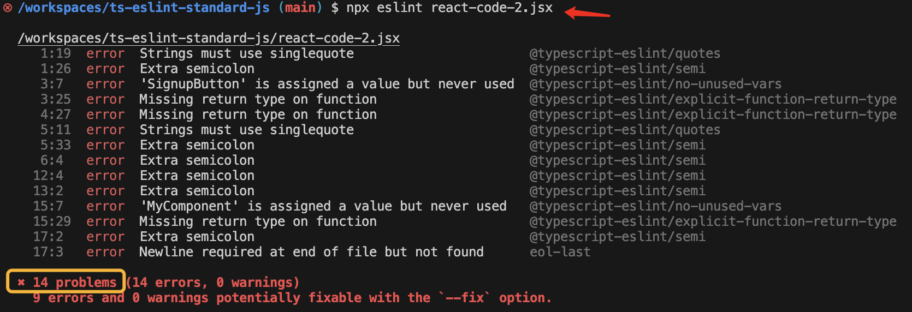
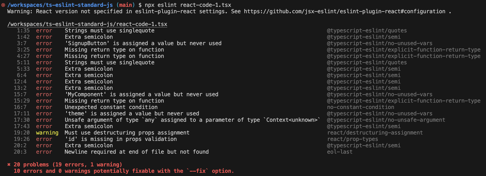

# Steps

## 1. Initial Jobs

If you're not setting in a new TypeScript project, you can skip this part 1.

### Init Git

Initialize a Git repository if you're starting a new project.

```sh
git init && \
echo 'node_modules' >> .gitignore
```

### Init Project

Initialize your packages.

```sh
npm init -y
```

I recommend you enable ES6 modules in your project, which indicates that your source code should use **import** syntax.

```sh
npm pkg set type="module"
```

### Install TypeScript

Run this in the terminal to install TypeScript.

```sh
npm install -D typescript
```

### Init TypeScript

Use the following command to initialize a new TypeScript.

```sh
npx tsc --init
```

A `tsconfig.json` will be created under your project.

## 2. ESLint Setting

### Install ESLint

Run this in the terminal to install ESLint packages.

```sh
npm install -D \
  eslint@^8.57.0 \
  typescript-eslint@^7.6.0 \
  eslint-plugin-promise@^6.0.0 \
  eslint-plugin-import@^2.25.2 \
  eslint-plugin-n@^15.0.0 \
  @typescript-eslint/eslint-plugin@^7.0.1 \
  eslint-config-love@latest \
  globals@^15.0.0
```

The packages installed include:

- ESLint Core
- ESLint shared configs & plugins of **Standard JS**, the most important one is `eslint-config-love`

### ESLint configuration

Create a file(.js) named `eslint.config.js` with the code below:

```js
import globals from 'globals'
import tseslint from 'typescript-eslint'

import path from 'path'
import { fileURLToPath } from 'url'
import { FlatCompat } from '@eslint/eslintrc'
import pluginJs from '@eslint/js'

// mimic CommonJS variables -- not needed if using CommonJS
const __filename = fileURLToPath(import.meta.url)
const __dirname = path.dirname(__filename)
const compat = new FlatCompat({
  baseDirectory: __dirname,
  recommendedConfig: pluginJs.configs.recommended
})

export default [
  { files: ['**/*.js'], languageOptions: { sourceType: 'script' } },
  { languageOptions: { globals: globals.browser } },
  ...tseslint.configs.recommended,
  ...compat.extends('love'),
]
```

I use `import` and `export` here because in Part 1 I set the package type to `module` to enable ES6 modules, if your project is not, you may name this file as `eslint.config.mjs`, or modify the `import` and `export` syntax to a `CommonJS` way.

> TODO

### Try Out

Run this to check the configuration file itself.

```sh
npx eslint eslint.config.js
```


### Try `.ts`

Create an `index.ts` with the code:

```js
const x = {
    a: "b",
    b: 123
};
```

And check its style.

```sh
npx eslint index.ts
```

That also works!


Besides, you can use `npx eslint .` to check all your files' styles with one command.

### Fix Code Style Issues

You can also use ESLint to automatically fix some illegal syntax and styles of your code.

```sh
npx eslint --fix index.ts
# npx eslint --fix .
```

Some problems will be fixed, like, the `"` has been changed to `'`, etc.


Of course, there are some problems that won't be automatically fixed, such as the used variables, usually ESLint won't fix them for you, you have to modify them yourself.

## 3. Automatic Commands

### Linting Command

edit `package.json`

```diff
{
  "scripts": {
    "test": "echo \"Error: no test specified\" && exit 1",
+   "lint": "eslint ."
```

Don't forget to exclude some files that should not be lint, create a `.eslintignore`:

```txt
node_modules
test
coverage
public
dist
```

now try the script

```sh
npm run lint
```

all problems in your js & ts files will be shown.


### Formatting Command

There are some problems that can be fixed by the command `eslint --fix`

edit `package.json`

```diff
{
  "scripts": {
+ "format": "eslint --fix ."
```

now try to format it

```sh
npm run format
```

Since some problems have been fixed, only those that can't be fixed will show.


> Once again, formatting codes using ESLint is self-asserting

## 4. Editor Setting

Using `npx eslint` and `npm run format` etc. to check and format every JS/TS file of your codebase can be a nightmare and sometimes uncontrollable.

You need to edit the code in the editor and run the commands in the terminal, you may be facing a huge amount of errors at the time you run `npm run lint`.

A way of easing the anxiousness is by integrating with **ESLint VS Code Extension**, to check and format the code problems along with your coding. i.e., make a mistake, be alerted by the editor immediately, and fix it right away.

### VS Code ESLint Extension

Now search `dbaeumer.vscode-eslint` on the Extensions pannel and install it.

> At the time I write this, I'm using the v3.0.5 (pre-release) of this extension. Other versions may have some unknown issues.

First, create the configure file.

```sh
mkdir .vscode && touch .vscode/settings.json
```

Edit `.vscode/settings.json` to enable the ESLint extension in your editor.

```json
{
  "eslint.enable": true
}
```

Reloading of your VS Code window is required. You'll see errors detected by ESLint, showing on the editor while you are editing the code, being highlighted with **wavy lines**, hovering on each wavy line will toggle the pop-up of the error details.


### Auto Format on Save

This extension can also fix your code linting issues automatically, looks like you are running `npx eslint` on the file you're editing.

Modify `.vscode/settings.json` with 3 more configurations:

```diff
- "eslint.enable": true
+ "eslint.enable": true,
+  "eslint.format.enable": true,
+  "editor.formatOnSave": true,
+  "editor.defaultFormatter": "dbaeumer.vscode-eslint"
```

Now every time you type some code, and press `command + s` to save them, those problems in the file can be automatically fixed will be automatically fixed.


The semicolon(s) will disappear after you press `command + s` to save your code.

### Extra Tricks

Configure your VS Code editor, to automatically insert 2 spaces after you click the `Tab` key, instead of inserting a real `Tab`, following the rule defined by [Standard JS](https://standardjs.com/rules).

To achieve this, edit `.vscode/settings.json` to add the following 3 configurations:

```diff
+  "editor.tabSize": 2,
+  "editor.insertSpaces": true,
+  "editor.detectIndentation": false
```

From now on no matter who opens your project in VS Code, his/her click of the `Tab` key will trigger an insert of 2 spaces, and a click of the `Backspace` key will trigger a deletion of a tab(2 spaces).

## 5. Linting React & React Hooks

### Linting React and React Hooks

```sh
npm install react react-dom
```

```sh
npm install -D @types/react @types/react-dom
```

create `react-code-1.tsx`:

```js
import React, { useContext } from "react";

const SignupButton = () => {
  const handleSignup = () => {
    alert("Sign up successful!");
  };

  return (
    <button onClick={handleSignup} className="signup-button">
      Sign Up
    </button>
  );
};

const MyComponent = (props) => {
  return (<div id={props.id} />)
};
```

There is some error in the editor.


That's because JSX syntax is not allowed yet in TypeScript configuration, edit `tsconfig.json`:

```diff
-    // "jsx": "preserve",                                /* Specify what JSX code is generated. */
+    "jsx": "react",                                /* Specify what JSX code is generated. */
```

The error above will disappear.

Now lint the `tsx` file with cli:

```sh
npx eslint react-code-1.tsx
```

You'll find 14 problems:


Create `react-code-2.jsx` with the same code as `react-code-1.tsx`, and lint it:

```sh
npx eslint react-code-2.jsx
```

You'll see some problems but not related to real code problems.


That's because `.jsx` file is not specified in the ESLint configuration, let's configure it in `eslint.config.js`:

```diff
export default [
-  { files: ['**/*.js'], languageOptions: { sourceType: 'script' } },
+  { files: ['**/*.{js,ts,jsx,tsx}'], languageOptions: { sourceType: 'script' } },
  { languageOptions: { globals: globals.browser } },
```

Lint it again and you'll get **14 errors** same as `react-code-1.tsx`.



These errors as only JS problems not specific to the best practise of React and React Hooks, we need to do more.

### Install React & React Hooks ESLint plugins

```sh
npm install -D eslint-plugin-react eslint-plugin-react-hooks
```

### config React ESLint plugin

First, config `eslint-plugin-react` in `eslint.config.js` with a new line:

```diff
export default [
  { files: ['**/*.{js,ts,jsx,tsx}'], languageOptions: { sourceType: 'script' } },
  { languageOptions: { globals: globals.browser } },
+  ...compat.extends('plugin:react/recommended'),
```

Now run `npx eslint react-code-1.tsx` you'll find 15 problems, in contrast with the previous 14 problems, because 1 more issue related to React which is stipulated in the plugin we just added, has been detected.


### defined or edit your own rule(s)

Ok let's take one further step, edit `eslint.config.js` to extend your self-customed rule:

```diff
export default [
  { files: ['**/*.{js,ts,jsx,tsx}'], languageOptions: { sourceType: 'script' } },
  { languageOptions: { globals: globals.browser } },
  ...compat.extends('plugin:react/recommended'),
  ...tseslint.configs.recommended,
  ...compat.extends('love'),
+  {
+    rules: {
+      'react/destructuring-assignment': ['warn', 'always']
+    }
+  }
]
```

Run `npx eslint react-code-1.tsx`, you'll get 1 more problem which is defined by you.

You can define or modify any rule as much as you can to tailor your team's rules here.


### config React Hooks ESLint plugin

Let's now integrate the best practice rules of React Hooks.

Edit `react-code-1.tsx`:

```diff
-import React from "react";
+import React, { useContext } from "react";

...

const MyComponent = (props) => {

+  if (true) {
+    const theme = useContext(ThemeContext);
+  }

  return (<div id={props.id} />)
};
```

Now lint it, and you'll find some errors, but none are related to React Hooks.



So you need to edit the ESLint config with 1 more line:

```diff
  ...compat.extends('plugin:react/recommended'),
+  ...compat.extends('plugin:react-hooks/recommended'),
  ...tseslint.configs.recommended,
```

lint `react-code-1.tsx` again you'll get errors related to React Hooks.


## Conclusion

Now you have a somewhat robust toolchain of linting and formatting your code.

Your Codes of:

**TypeScript and JavaScript**

**React and React Hooks**

will all be ensured by:

**Checking and Formatting CLI scripts**

**Checking and Formatting editor tools**
