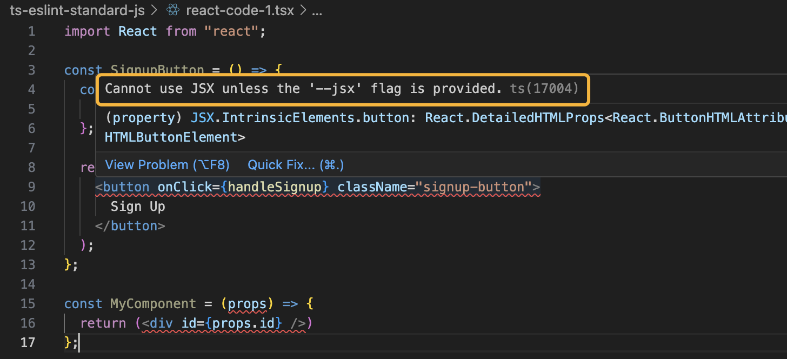
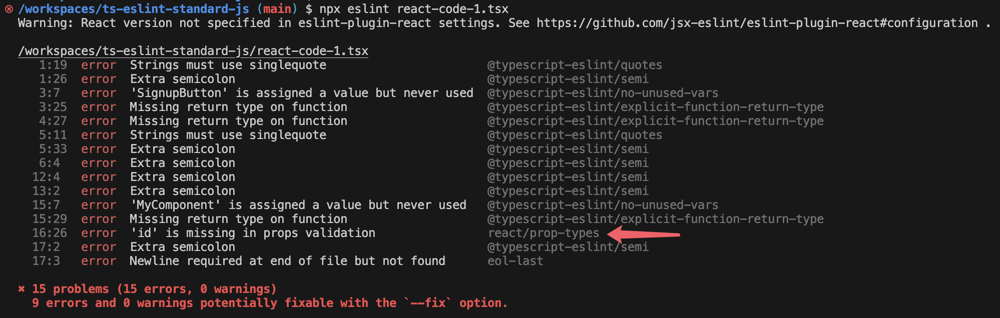

# Configure ESLint in a TypeScript project to adhere to Standard JS

**Integrate [JavaScript Standard Style](https://standardjs.com/rules) in ESLint to lint and format TypeScript, primarily using [`eslint-config-love`](https://github.com/mightyiam/eslint-config-love).**

**Enhance the setup with VS Code tips for automatic formatting.**

**Include ESLint plugins for React and React Hooks**

## Introduction

Configuring ESLint in a TypeScript project is nothing much, the more challenging aspect is choosing a **Code Style** for your team.

You may be torn between those famous code styles, struggling to choose one between [Airbnb JavaScript Style](https://github.com/airbnb/javascript), [Google JavaScript Style Guide](https://google.github.io/styleguide/jsguide.html), [JavaScript Standard Style](https://standardjs.com/rules), or [XO](https://github.com/xojs/xo), among others.

What's worse, you and your teammates may be arguing about whether you should use `;` at the end of each line, whether `if() {` should have a space after `if`, whether `function foo () {return true}` is a bad way and should change it to `function foo () { return true }`, and so on.

In my personal perspective, it doesn't matter which style you choose, but you need a **unified and strict** style across a team. Once the rules are set, don't argue about them anymore, as long as the rules are detailed.

So, self-assertively, I have chosen [JavaScript Standard Style](https://standardjs.com/rules), also known as Standard JS, even though it is not at all standard—the name is somewhat misleading.

Standard JS is **simple, clear, straightforward, and detailed**, and I think sticking to the rules makes JS/TS code very **clean**.

**It doesn't allow configurations**, **rules are rules**. No configurations, which is by design to avoid too much bikeshedding over style choices, So I don't need to argue with my teammates.

Examples.

```js
window.alert('hi')   // ✓ ok
window.alert('hi');  // ✗ avoid
```

```js
console.log('hello there')    // ✓ ok
console.log("hello there")    // ✗ avoid
console.log(`hello there`)    // ✗ avoid
```

```js
/* comment */ // ✓ ok
/*comment*/   // ✗ avoid
```

...

I have to admit that Standard JS is **opinionated**, and choosing it is a subjective thing. Some people even hate it—we're all right.

In this post, I also use ESLint + Standard JS as my **code formatting** tools. Formatting JS/TS code by using ESLint is also subjective and opinionated, arguably most people would rather use [Prettier](https://prettier.io/) instead, which provides more configurable options.

But like I said before, Standard JS's philosophy is "rules are rules", its rules are detailed, some arguable rules are strictly normalised and no compromises are allowed, customising Prettier's options will lead me back to endless arguments with my teammates.

Sorry, I've gone too far. I'm not here to persuade you to use Standard JS. My intention is to provide information and guidance on configuring [JavaScript Standard Style](https://standardjs.com/) for your team, should you agree with me or have other reasons to choose it.

### GitHub Repo

If you'd prefer to run the demo I've created instead of following the steps individually, check out this [GitHub repository](https://github.com/graezykev/ts-eslint-standard-js/tree/main) for a quick overview and hands-on experience.

## Key Takeaways

I primarily divide this post into 5 parts.

1. [Initial Setup](#1-initial-setup)
2. [ESLint Configuration](#2-eslint-configuration)
3. [Editor (VS Code) Integration](#3-editor-vs-code-integration)
4. [Automate Linting and Formatting](#4-automate-linting-and-formatting)
5. [Linting React & React Hooks](#5-linting-react--react-hooks)

## 1. Initial Setup

If you're not setting up a new TypeScript project, you can skip this part 1.

### Init Git

Initialize a Git repository if you're starting a new project.

```sh
mkdir ts-eslint-standard-js && \
cd ts-eslint-standard-js && \
git init && \
echo 'node_modules' >> .gitignore
```

### Init Project

Initialize your NPM package.

```sh
npm init -y
```

I recommend enabling ES6 modules in your project, indicating that your source code should use **import** syntax.

```sh
npm pkg set type="module"
```

I also recommend upgrading your Node.js version and specifying the minimum version requirements in your project.

```sh
npm pkg set engines.node=">=18.18.0 <19 || >=20.9.0 <21 || >=21.1.0"
```

### Install TypeScript

Run this in your terminal to install TypeScript.

```sh
npm install -D typescript
```

### Init TypeScript

Use the following command to initialize a new TypeScript project.

```sh
npx tsc --init
```

A `tsconfig.json` will be created under your project.

## 2. ESLint Configuration

### Install ESLint

Run the command below to install **ESLint** packages.

```sh
npm install -D \
  eslint@^8.57.0 \
  typescript-eslint@^7.6.0 \
  eslint-plugin-promise@^6.0.0 \
  eslint-plugin-import@^2.25.2 \
  eslint-plugin-n@^15.0.0 \
  @typescript-eslint/eslint-plugin@^7.0.1 \
  eslint-config-love@latest \
  globals@^15.0.0
```

> Note: These versions can be changed in the future.

The packages installed include:

- ESLint Core
- ESLint shared configs and plugins for **Standard JS**, with the most important one being `eslint-config-love`.

### ESLint configuration

Create a file named `eslint.config.js` with the code below:

```js
import globals from 'globals'
import tseslint from 'typescript-eslint'

import path from 'path'
import { fileURLToPath } from 'url'
import { FlatCompat } from '@eslint/eslintrc'
import pluginJs from '@eslint/js'

// mimic CommonJS variables -- not needed if using CommonJS
const __filename = fileURLToPath(import.meta.url)
const __dirname = path.dirname(__filename)
const compat = new FlatCompat({
  baseDirectory: __dirname,
  recommendedConfig: pluginJs.configs.recommended
})

let a

export default [
  { files: ['**/*.js'], languageOptions: { sourceType: 'script' } },
  { languageOptions: { globals: globals.browser } },
  ...tseslint.configs.recommended,
  ...compat.extends('love')
]
```

I use `import` and `export` here because in Part 1 I set the package type to `module` to enable ES6 modules. If your project does not use ES6 modules, you may name this file as `eslint.config.mjs` or modify the `import` and `export` syntax to use `CommonJS`.

There are only 2 lines you need to notice now.

```js
  ...tseslint.configs.recommended,
  ...compat.extends('love')
```

The first line instructs ESLint to parse and check TypeScript syntax, while the second line enforces adherence to [Standard JS rules](https://standardjs.com/rules) for both JavaScript and TypeScript code.

### Try Out

Run this command to verify the configuration file itself:

```sh
npx eslint eslint.config.js
```

Yes, there are indeed some errors in the configuration file.


### Try `.ts`

Create an `index.ts` with the code:

```js
const x = {
    a: "b",
    b: 123
};
```

And check its code style:

```sh
npx eslint index.ts
```

Showing the errors means the configurations also work for TS!


Besides, you can use `npx eslint .` to check the style of all your files with one command.


### Fix Code Style Issues

You can use the `--fix` flag in ESLint to automatically correct some of the illegal syntax and style issues in your code.

```sh
npx eslint --fix index.ts # npx eslint --fix .
```

Some issues will be automatically fixed, such as changing `"` to `'`, removing unnecessary semicolons at the end of lines, and so on.


Certainly, there's still **1 problem left**, as not all issues can be automatically resolved. For instance, ESLint typically won't fix **unused variables**; you'll need to address those manually.

## 3. Editor (VS Code) Integration

Using `npx eslint .` and `npx eslint --fix .` to check and format every JS/TS file in your codebase can be a nightmare, which is laborious and sometimes uncontrollable.

Imagine you need to edit the code in the editor and run the commands in the terminal, you may be facing a huge amount of errors at the time you run `npx eslint`.

A way to ease the anxiety is by integrating with the **ESLint VS Code Extension**. It checks and formats the code problems along with your coding. For example, if you make a mistake, you'll be alerted by the editor immediately and can fix it right away.

> You may not be using VS Code, but other editors like WebStorm offer similar solutions.

### VS Code ESLint Extension

Search for `dbaeumer.vscode-eslint` in the Extensions panel and install it.

> At the time I write this, I'm using version 3.0.5 (pre-release) of this extension. Other versions may have some unknown issues.

First, create the configuration file.

```sh
mkdir .vscode && \
touch .vscode/settings.json
```

Edit `.vscode/settings.json` to enable the ESLint extension in your editor.

```json
{
  "eslint.enable": true
}
```

Reloading your VS Code window is required. You'll see errors detected by the ESLint extension showing up in the editor while you are editing the code. These errors will be highlighted with **wavy lines**.


Hovering over each wavy line will toggle a pop-up displaying the error details.


### Auto Format on Save

This VS Code ESLint extension can also automatically fix your code's linting issues. It operates similarly to running `npx eslint` on the file while you're editing it.

Modify `.vscode/settings.json` with some additional configurations:

```json
  "eslint.format.enable": true,
  "editor.formatOnSave": true,
  "[javascript]": {
    "editor.defaultFormatter": "dbaeumer.vscode-eslint"
  },
  "[typescript]": {
    "editor.defaultFormatter": "dbaeumer.vscode-eslint"
  },
  "[javascriptreact]": {
    "editor.defaultFormatter": "dbaeumer.vscode-eslint"
  },
  "[typescriptreact]": {
    "editor.defaultFormatter": "dbaeumer.vscode-eslint"
  }
```

Now, every time you type some code and press `Command + S` to save them, the problems in the file that can be automatically fixed will be corrected automatically, just look like your are running `eslint --fix eslint.config.js`.


The semicolons will disappear after you press `Command + S` to save your code.

By sharing this `settings.json` in Git or any other version control tools, if your teammates have the extension `dbaeumer.vscode-eslint` installed, the same behavior will occur in their VS Code.

### Recommend Installing the Extension

You can recommend your teammates to install `dbaeumer.vscode-eslint` via the following configure.

```sh
touch .vscode/extensions.json && \
echo '{   
  "recommendations": ["dbaeumer.vscode-eslint"]
}' > .vscode/extensions.json
```

VS Code prompts your teammates to install `dbaeumer.vscode-eslint` when the project is opened for the first time.


### devcontainer

If your team is using a **Cloud Development Environment** such as [GitHub Codespaces](https://github.com/features/codespaces), or [Dev Containers](https://code.visualstudio.com/docs/devcontainers/tutorial) such as Docker, you can even share the installation of `dbaeumer.vscode-eslint` with your teammates, via `devcontainer.json`.

When someone opens the project in VS Code, the specified extension (as well as the specific version) `dbaeumer.vscode-eslint@3.0.5` will be automatically installed within the devcontainer.

The automatic installation only applies to the devcontainer environment.

I love this, but it's a larger topic, and I won't elaborate too much on it here, you can just give it a try.

```sh
mkdir .devcontainer && \
touch .devcontainer/devcontainer.json && \
echo '{
  "name": "ts-eslint-standard-js",
  "customizations": {
    "vscode": {
      "extensions": [
        "dbaeumer.vscode-eslint@3.0.5"
      ]
    }
  }
}' > .devcontainer/devcontainer.json
```

### Extra Tricks

Different developers have their own default editor behaviors.

For instance, in your VS Code, pressing the `Tab` key may produce a tab with a width of 4 spaces, while for your teammates, it may produce 2 spaces or 4 spaces, depending on their default settings.

Under the rules of [Standard JS](https://standardjs.com/rules), the use of real **tabs** for code indentation is not allowed; instead, you have to use 2 spaces.

To collaborate better with your teammates or enforce the rules of our code style more strictly, I recommend configuring the VS Code editor and sharing the configurations to unify this behavior. For example, you can set it to automatically insert 2 spaces after pressing the `Tab` key instead of inserting a real **tab**, following the rule defined by [Standard JS](https://standardjs.com/rules).

To achieve this, add the following 3 configurations to `.vscode/settings.json`:

```json
  "editor.tabSize": 2,
  "editor.insertSpaces": true,
  "editor.detectIndentation": false
```

From now on, whenever someone opens your project in VS Code, pressing the `Tab` key will insert 2 spaces, and pressing the `Backspace` key will delete 2 spaces.

## 4. Automate Linting and Formatting

In this section, we'll integrate checking and formatting commands into your project's NPM scripts. This enables you to execute batched tasks or run them in your **CI workflows** and **[Git Hooks](https://github.com/graezykev/normalise-your-git-commit-and-push/blob/main/steps.md)**.

### Linting Command

Edit your `package.json`.

```diff
{
  "scripts": {
    "test": "echo \"Error: no test specified\" && exit 1",
+   "lint": "eslint ."
```

Don't forget to exclude some files that should not be linted. Create a `.eslintignore` file and add the necessary exclusions to it.

```txt
node_modules
test
coverage
public
dist
```

Now try the script:

```sh
npm run lint
```

All ESLint problems in your JavaScript/TypeScript files will be displayed.


### Formatting Command

As mentioned above, some problems can be fixed by the command `eslint --fix`. So We can leverage this command as a way to batch format your code.

Edit `package.json`:

```diff
{
  "scripts": {
+   "format": "eslint --fix .",
```

And try formatting it:

```sh
npm run format
```

Since some problems have been fixed, only those that can't be fixed will be displayed.


### Why do I need NPM scripts

You must find that the commands of `npm run lint` and `npm run format` have no difference from `npx eslint .` and `npx eslint --fix .` respectively.

Well, when you run `npx eslint .` directly, it attempts to execute the ESLint tool from your project’s local dependencies (ESLint under the `/node_modules/.bin/` directory of your project). However, if ESLint is not installed within your project, `npx` will attempt to run the globally installed ESLint instead.

However, the NPM script `"lint": "eslint ."` ensures that ESLint is only executed within your project. If ESLint is not installed, running this script will result in an error.

By strictly defining the specific version (or version ranges) of ESLint in your `package.json`, you can avoid conflicts between ESLint versions installed globally and those required for your project.

What's more, your `lint` script might include additional flags or options specific to your project. NPM scripts, with more semantic indicators, allow you to abstract away those complex commands or tool configurations.

I have another post on [How to Normalize Your Git Commit and Push Processes](https://github.com/graezykev/normalise-your-git-commit-and-push/blob/main/steps.md), leveraging the NPM scripts. Check it out for more ideas that can enhance your workflow.

## 5. Linting React & React Hooks

JavaScript Standard Style is less opinionated about JSX formatting and largely leaves JSX as-is. In a React project, you should integrate with React-specific linting rules for ESLint. The generally accepted configurations are [eslint-plugin-react](https://github.com/jsx-eslint/eslint-plugin-react) and [eslint-plugin-react-hooks](https://github.com/facebook/react/tree/main/packages/eslint-plugin-react-hooks), enforcing some best practices of writing React code.

### Dependencies

First, install React and its type definitions.

```sh
npm install react react-dom
```

```sh
npm install -D @types/react @types/react-dom
```

### Disable VS Code Extension (temporary)

In the next steps, I'm going to create some code, but I don't want them to be auto-fixed by ESLint.

So, before we proceed, let's disable the ESLint VS Code Extension to better demonstrate how the following linting configurations work. (But **this is only an intermediate step; don't forget to undo the change in the end**.)


### Let TypeScript to Recognize JSX

Next, let's create a sample file `react-code-1.tsx` to write some React (JSX) code.

```js
import React from "react";

const SignupButton = () => {
  const handleSignup = () => {
    alert("Sign up successful!");
  };

  return (
    <button onClick={handleSignup} className="signup-button">
      Sign Up
    </button>
  );
};

const MyComponent = (props) => {
  return (<div id={props.id} />)
};
```

There are some errors visible in the editor.



That's because JSX syntax is not allowed yet in TypeScript configuration.

Edit `tsconfig.json` to enable it:

```diff
-    // "jsx": "preserve",                                /* Specify what JSX code is generated. */
+    "jsx": "react",                                /* Specify what JSX code is generated. */
```

Then the error above will disappear.

Next, lint the `.tsx` file:

```sh
npx eslint react-code-1.tsx
```

You'll find 14 problems, indicating that ESLint is enabled for `.tsx` files.


### Ask ESLint to Recognize `.jsx`

Create a `react-code-2.jsx` file with the same code as `react-code-1.tsx`, and lint it.

```sh
npx eslint react-code-2.jsx
```

You may see some problems, but they are not actual code style issues.


That's because the `.jsx` file extension is not specified in the ESLint configuration. Let's configure it in `eslint.config.js`:

```diff
export default [
-  { files: ['**/*.js'], languageOptions: { sourceType: 'script' } },
+  { files: ['**/*.{js,ts,jsx,tsx}'], languageOptions: { sourceType: 'script' } },
```

Lint it again, and you'll get **14 errors**, the same as `react-code-1.tsx`.


These errors in `react-code-1.tsx` and `react-code-2.jsx` are code style problems, however, they are still not React-specific problems. We need to do more.

### Install React & React Hooks ESLint plugins

```sh
npm install -D eslint-plugin-react eslint-plugin-react-hooks
```

### Configure React ESLint Plugin

First, configure `eslint-plugin-react` in `eslint.config.js` with just a new line.

```diff
export default [
  { files: ['**/*.{js,ts,jsx,tsx}'], languageOptions: { sourceType: 'script' } },
  { languageOptions: { globals: globals.browser } },
+ ...compat.extends('plugin:react/recommended'),
  ...tseslint.configs.recommended,
  ...compat.extends('love')
```

Run command to lint it.

```sh
npx eslint react-code-1.tsx
```

You'll find **15 problems**. This is one more issue compared to the previous **14 problems**, because an additional problem related to React, specified in the plugin `eslint-plugin-react`, has been detected.



### Self-Customize your Own Rule(s)

Ok, let's take one further step and edit `eslint.config.js` to extend your custom rule:

```diff
export default [
  { files: ['**/*.{js,ts,jsx,tsx}'], languageOptions: { sourceType: 'script' } },
  { languageOptions: { globals: globals.browser } },
  ...compat.extends('plugin:react/recommended'),
  ...tseslint.configs.recommended,
  ...compat.extends('love'),
+  {
+    rules: {
+      'react/destructuring-assignment': ['warn', 'always']
+    }
+  }
]
```

Run `npx eslint react-code-1.tsx`, and you'll notice one additional problem defined by you.


You can define or modify any rules as much as you like to tailor your team's rules here.

### Configure React Hooks ESLint Plugin

Let's now integrate the best practice rules for React Hooks.

Edit `react-code-1.tsx` to include some React Hooks code.

```diff
-import React from "react";
+import React, { useContext } from "react";

...

const MyComponent = (props) => {

+  if (true) {
+    const theme = useContext(ThemeContext);
+  }

  return (<div id={props.id} />)
};
```

Now lint it.

```sh
npx eslint react-code-1.tsx
```

And you'll find some errors, but **none of them are related to React Hooks**.


You just need to edit the ESLint configuration with one additional line.

```diff
  ...compat.extends('plugin:react/recommended'),
+ ...compat.extends('plugin:react-hooks/recommended'),
  ...tseslint.configs.recommended,
```

Lint `react-code-1.tsx` again, and you'll get errors related to React Hooks.


There's one more thing you may have noticed: the warning.


Add the following configurations to automatically detect the React version and eliminate the warning.

```diff
  ...compat.extends('love'),
  {
+    settings: {
+      react: {
+        version: 'detect'
+      }
+    },
    rules: {
```

## Conclusion

Now you have a somewhat robust toolchain for linting and formatting your code.

Your Codes of **TypeScript and JavaScript**, writing features using **React and React Hooks**, will all be ensured through **Checking and Formatting CLI scripts** and **Checking and Formatting editor tools**.

The **TypeScript and JavaScript** code, including features developed with **React and React Hooks**, will be **validated and formatted** using **CLI scripts and editor tools**.

We also provide a method to **customize** the rules for React and React Hooks or to extend them with your own rules.

Next, you may want to integrate your linting scripts with your Git Hooks or CI/CD workflows. For Git Hooks, I have another post that elaborates on the steps. Check it out if you're interested.

[How to Normalise Your Git Commit and Push Processes](https://github.com/graezykev/normalise-your-git-commit-and-push/blob/main/steps.md)

**Last but not least, any suggestions, corrections, questions, or disagreements will be greatly appreciated.**
